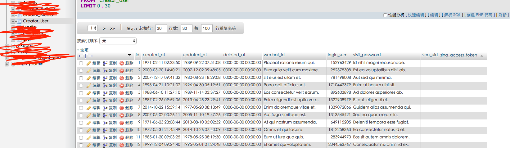

# K-Laravel_Creator

Hope this can help you quickly build API

* **loadtime:** Report of the dom related time and ATF
* **network:** Report the resource requests timeout
* **error:** Record the request and error code

## Instructions

Close it on the web, send a statistical package

## Install

`composer install 404_k/k_laravel_creator`

## Use

### Set Entity

```php
use K_Laravel_Creator\Entities\Base_Entity;


class Creator_User_Entity extends Base_Entity{

    public static $entity = [
        "User" => "用户"
    ];
    
    // if has on to many entity 
    public static $has_many = ['Creator_Activity'];

    public static function get_attribute(){
        $attribute = array();
        $attribute['wechat_id'] = parent::set_attribute("微信ID","string");
        $attribute['login_sum'] = parent::set_attribute("登陆次数","int");
        $attribute['visit_password'] = parent::set_attribute("访问密码","string");
        $attribute['sina_uid'] = parent::set_attribute("新浪id","string");
        $attribute['sina_access_token'] = parent::set_attribute("新浪密钥","string");
        return array_merge(parent::get_attribute(),$attribute);
    }
}

```

## Add Entity to config 

In /config/creator.php

```php
<?php

return [
    'entities' => [
        'Creator_User'
    ]
];

```

## Creator Code and Datatbase table

`php artisan make:k_command`


## Result

### database table



### API 

#### insert  

`http://url/v1/Creator_User_Controller/query?id=161`

```JSON
{
  "result": true,
  "data": [
    {
      "updated_at": "2017-06-02 07:53:32",
      "created_at": "2017-06-02 07:53:32",
      "id": 161,
      "patient_name": "11111",
      "creator_activity": []
    }
  ]
}
```

### update

`http://inner.journey.404mzk.com/v1/Creator_User_Controller/update?id=161&wechat_id=1`

```JSON
{
  "result": true
}
```

#### query

`http://url/v1/Creator_User_Controller/query?id=161`

```JSON
{
    "total": 1,
    "per_page": 15,
    "current_page": 1,
    "last_page": 1,
    "next_page_url": null,
    "prev_page_url": null,
    "from": 1,
    "to": 1,
    "data": [
        {
            "id": 161,
            "wechat_id": 1,
            ...
            "creator_activity": [
                {
                    "id": 337,
                    ...
                },
                {
                    "id": 338,
                    ...
                }
            ]
        }
    ]
}
```


### delete

`http://inner.journey.404mzk.com/v1/Creator_User_Controller/delete?id=161`

```JSON
{
  "result": true 
}
```

